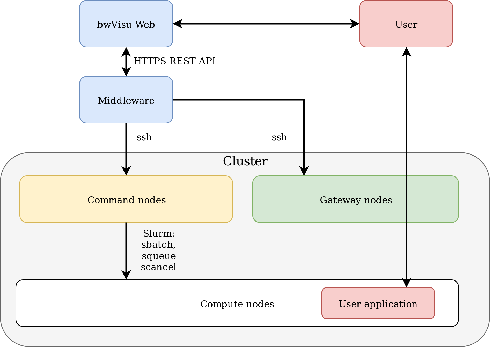

# bwVisu technical documentation

## Architecture

The bwVisu stack consists of multiple parts:
* A webfrontend provides a user interface for users to interact with bwVisu. The webfrontend in turn interacts with the bwVisu middleware via a [REST API](middleware-api.md);
* A middleware that reacts to requests from the web frontend and manages bwVisu jobs on a cluster;
* An HPC-like cluster running Slurm where the bwVisu application images are available and can be executed using singularity. bwVisu integrates very well with existing HPC cluster deployments and imposes very few requirements on the cluster.
* The bwVisu application images

The rough architecture therefore looks something like this:
```

User <-------> Webfrontend <------> Middleware <-----> HPC Cluster
       HTTPS                HTTPS                SSH
                            (REST API)
```


The following image illustrates the bwVisu architecture in more detail:




## Webfrontend

## Middleware

## Cluster
The bwVisu backend cluster can in principle be any regular HPC cluster. bwVisu has been designed to be minimally invasive and imposes very few requirements on the cluster. See [here](backend.md) for a detailed description on how to tell the middleware how to talk to an existing cluster, and which prerequisites must be met.

## Applications
